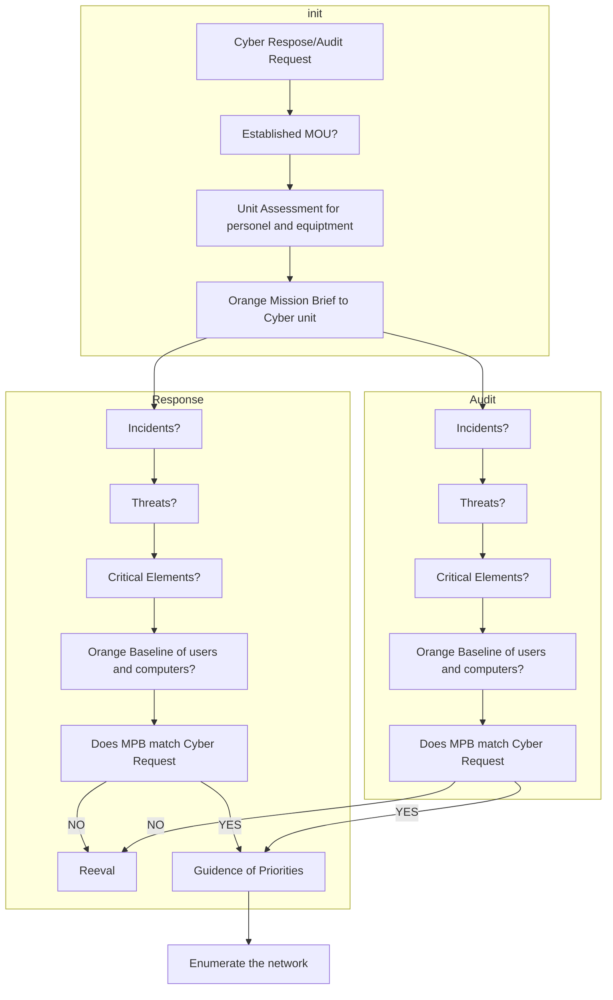

```mermaid
---
Title: Command planning phase
---
flowchart TD
    subgraph init
    A[Cyber Respose/Audit Request]
    B[Established MOU?]
    C[Unit Assessment for personel and equiptment]
    D[Orange Mission Brief to Cyber unit]
    A --> B
    B --> C
    C --> D
    end

    subgraph Response
    D --> r1
    r1[Incidents?] --> r2
    r2[Threats?] --> r3
    r3[Critical Elements?] --> r4
    r4[Orange Baseline of users and computers?] --> r5
    r5[Does MPB match Cyber Request]
    r5 --> |NO| Reeval
    r5 --> |YES| H
    end

    subgraph Audit
    D --> k1
    k1[Incidents?] --> k2
    k2[Threats?] --> k3
    k3[Critical Elements?] --> k4
    k4[Orange Baseline of users and computers?] --> k5
    k5[Does MPB match Cyber Request]
    k5 --> |NO| Reeval
    k5 --> |YES| H
    end

    H[Guidence of Priorities]
    H --> I[Enumerate the network]
```

# TODO - Color Code who owns which step
# TODO - Shape code paperwork, computer work, intel, etc
