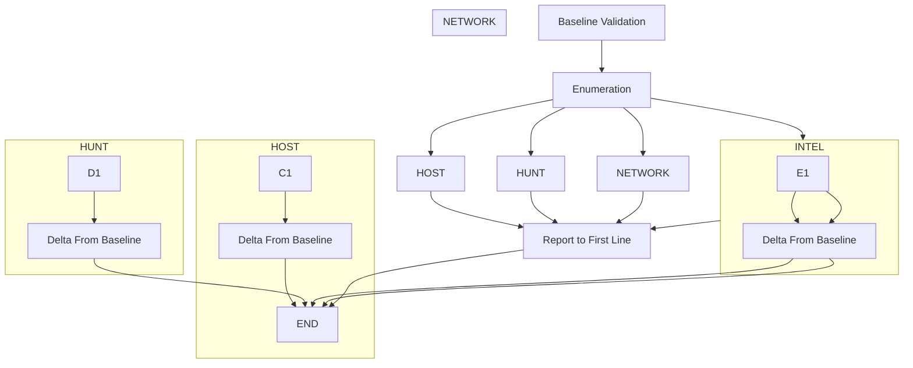

```mermaid
---
Title: Scanning and Validation Flow
---
flowchart TD
    A[Baseline Validation] --> B

    B[Enumeration]

    B --> HOST
    B --> HUNT
    B --> INTEL
    B --> NETWORK

    subgraph HOST 
    C1 --> C2[Delta From Baseline]
    C2 --> Z
    end

    subgraph HUNT 
    D1 --> D2[Delta From Baseline]
    D2 --> Z
    end

    subgraph INTEL
    E1 --> E2[Delta From Baseline]
    E2 --> Z
    end

    subgraph NETWORK 
    E1 --> E2[Delta From Baseline]
    E2 --> Z
    end

    HOST --> Y
    HUNT --> Y
    INTEL --> Y
    NETWORK --> Y

    Y[Report to First Line] --> Z
    Z[END]
```
# A B C D E F G H I J K L M N O P Q R S T U V W X Y Z
# TODO - Color Code who owns which step
# TODO - Shape code paperwork, computer work, intel, etc
